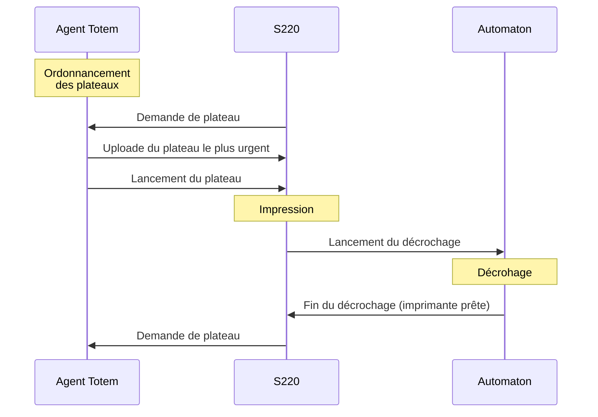

# Manuel d'utilisation — Automaton Sentry 220

**3DTOTEM — Usage opérateur**  
Version : Automaton4 | Mise à jour : mai 2026

---

## Table des matières

1. [Vue d'ensemble du système](#1-vue-densemble-du-système)
2. [Indicateurs visuels — LEDs de façade](#2-indicateurs-visuels--leds-de-façade)
3. [Démarrage et vérifications avant un cycle](#3-démarrage-et-vérifications-avant-un-cycle)
4. [Déroulement d'un cycle automatique](#4-déroulement-dun-cycle-automatique)
5. [Opérations manuelles depuis l'interface NanoDLP](#5-opérations-manuelles-depuis-linterface-nanodlp)
6. [Maintenance avant chaque cycle](#6-maintenance-avant-chaque-cycle)
7. [Maintenance périodique](#7-maintenance-périodique)
8. [Résolution des problèmes courants](#8-résolution-des-problèmes-courants)
9. [Arrêt d'urgence](#9-arrêt-durgence)
10. [Contacts et ressources](#10-contacts-et-ressources)

---

## 1. Vue d'ensemble du système

L'Automaton est le système d'impression 3D résine automatisé de la Sentry 220. Il enchaîne les impressions sans intervention humaine entre chaque plateau.

### Composants principaux

| Composant | Entité | Rôle |
|---|---|---|
| **Raspberry Pi** | Sentry 220 | Cerveau du système, exécute tous les scripts Python |
| **Carte Arduino (MKS)** | Automaton | Pilote les moteurs, capteurs mécaniques et LEDs |
| **NanoDLP** | Sentry 220 | Logiciel de gestion de l'impression (interface web) |
| **Agent Totem** | Agent| Serveur distant gérant la file d'attente des plateaux |
| **Écran Nextion** | Automaton | Affichage de l'état de la machine et boutons physiques |
| **Capteur de force (HX711)** | Sentry 220 | Détecte la présence et le poids du plateau |
| **Caméra IR** | Sentry 220 | Prend des photos en fin de cycle pour contrôle qualité |
| **Réservoir résine** | Automaton | Alimenté automatiquement par le système de remplissage |

### Diagramme de communication Agent <> S220 <> Automaton simplifié



---

## 2. Indicateurs visuels — LEDs de façade

Les LEDs RGB sur la façade de la machine indiquent l'état en temps réel.

| Couleur | Signification | Action requise |
|---|---|---|
| **Cyan fixe** | Machine en attente (IDLE) | Aucune |
| **Vert fixe** | Mode test activé (sans plateau) | Désactiver le mode test si non intentionnel |
| **Rouge fixe** | Impression en cours | Aucune |
| **Violet fixe** | Cycle de décrochage en cours | Ne pas ouvrir la machine |
| **Rouge clignotant** | Arrêt d'urgence déclenché | Voir section [Arrêt d'urgence](#9-arrêt-durgence) |

> **Important :** Ne pas ouvrir l'automaton si les LED sont **violette**. Car cela veut dire qu'il y a des mouvement mécanique qui ne sont pas protéger. De plus n'ouvrez pas l'automaton si il reste moins de 50 couches sur l'impression. Car vous risquerez de ne pas pouvoir fermer l'automaton à temps (avant que le cycle de décrochage ce lance). Enfin tant que la machine est brancher au secteur **même si le bouton On/Off est sur Off**, il y a un risque d'électrocution si vous enlevez le capot supérieur de la machine. 

---

## 3. Démarrage et vérifications avant un cycle

### 3.1 Mise sous tension

1. Allumer l'alimentation principale de la Sentry 220.
2. Allumer l'automaton  
3. Attendre le démarrage complet du Raspberry Pi (environ 60 secondes). L'écran tactile de l'imprimante change de page.
4. Les LEDs passent en **cyan fixe** : le système est prêt.
5. L'écran tactile de l'automaton affiche la page principale avec le bouton **"Lancement Cycle"**.

### 3.2 Vérifications obligatoires au démarrage

Avant tout lancement de cycle, vérifier les points suivants :

1. Les LEDs de façade sont en **cyan fixe** (pas de rouge clignotant).
2. L'écran Nextion est allumé et affiche la page principale.
3. Le tiroir de récupération est bien rentré dans l'automaton.
4. Calibrer le plateau d'impression (suivre les étapes de l'écran **Maintenance** => **Axe Z** => **Calibration**)
5. La résine dans le réservoir est au niveau du capteur du bac d'impression.
6. Vérifier que l'Agent Totem est accessible sur le réseau.
7. La file d'impression sur l'Agent Totem contient au moins un plateau.

### 3.3 Vérifier la connexion à l'Agent Totem
Afin de réaliser l'étape 6. ci dessus, suiver l'une des méthode expliquer ci dessous.

#### 1re solution : avec un navigateur web

Si vous connaissez l'adresse IP de l'agent, vous pouvez la rentrer dans un navigateur web afin de savoir s'il est accessible. 

#### 2e solution : avec l'exécutable Totem_finder.exe
Si vous ne connaissez pas l'adresse IP de l'agent, dans ce cas-là vous pouvez utiliser l'exécutable .  
Ouvrez l'exécutable sur votre ordinateur, dans l'onglet *Détection Agent*, choisissez Le réseau ou l'automaton et l'agent sont, puis appuyez sur *Lacncer la découverte*. Cela vous donnera l'adresse IP de l'agent ainsi qu'un bouton pour vous y connecter. 

#### 3e solution : terminal SSH
Avec le terminal SSH, connectez-vous à l'imprimante. Puis rentrez cette commande :

```bash
python3 /home/pi/3dTotem_PythonApp/automaton/agent_V2/check_agent.py
```

Ce script vérifie automatiquement que l'Agent Totem est joignable. Si l'adresse IP a changé, il la recherche sur le réseau local et met à jour la configuration.

---

## 4. Déroulement d'un cycle automatique

Un cycle complet se déroule en plusieurs étapes automatiques.

### Étape 0 — Lancement du cycle automatique

Pour lancer le cycle des impressions automatisé il y a plusieurs façon de de le faire. 
- **Interface Nanodlp :** Sur l'interface Nanodlp sur la home paeg il s'uffit de cliquer sur le bouton *Lancement cycle auto*
- **Ecran tactile de l'automaton :** La aussi il suffit d'appuyer sur le bouton *Lancement Cycle* qui est sur la page principale
- **Agent Totem :** Dans l'onglet imprimante, il faut appuyer sur les deux flèches circulaire à cotée de l'imprimante d'ont vous voulez lancer le cycle.

### Étape 1 — Lancement du plateau

- Le script `lancement_cycle.py` contacte l'Agent Totem.
- Le premier plateau de la file d'attente est envoyé à NanoDLP.
- L'écran Nextion bascule le bouton sur **"Fin de Cycle"**.
- l'agent lance l'impression du plateau qu'il vient d'uploader
- Les LEDs passent en **rouge fixe**.

### Étape 2 — Impression

- Le capteur de force surveille si il y a un plateau au début de l'impression et si il n'y a pas de poids suplémentaire sur le palteau (modèles non décrocher). Puis sur la déscente du plateau il vérifie si il n'y a pas de colision entre le plateau et un objet solide avant que le plateau n'arrive à sa position basse.
- Ensuite NanoDLP gère tout le cycle d'impression (Mouvement du plateau, affichage de la couche, allumage et extinction des LED UV)

### Étape 3 — Cycle de décrochage (fin d'impression)

Après la dernière couche, `Cycle_Decrochage.py` s'exécute automatiquement :

1. Les LEDs passent en **violet** pendant tout le cycle de décrochage.
2. **Vérification du panier** : l'Arduino confirme la présence du panier de récolte.
3. **Photo IR initiale** : prise de vue pour contrôle qualité avant décrochage.
4. **Montée en position haute** : le plateau remonte à la position Z haute (≈ 212 mm).
5. **Démarrage du cycle Arduino** : commande envoyée à l'Arduino (code `0xA0`).
6. **Avance du tiroir** : le tiroir de récupération des modèles avance sous le plateau.
7. **Descente en position de décrochage** : le plateau descend (≈ 190 mm).
8. **Temporisation de décrochage** : attente de 8 secondes pour le détachement. Afin de s'assurer que le plateau soit bien en position avant de commencer le raclage
9. **Raclage** : la lame racle le plateau afin de décrocher les modèles.
10. **Recul de la lame** : La lame commence à reculer, puis le plateau remonte en position haute(≈ 212 mm). Le faite de remonter le plateau dans un second temps permet de retirer quelques éléments qui pourrait géner au prochain décrochage. 
11. **Recul du tiroir** : le tiroir de récupération de modèles recule en position initiale. Ce qui fait tomber les modèles dans le panier de récupération une fois que le tiroir est sufisament rentrer.
12. **Vérification et remplissage du bac** : le niveau de résine est mesuré et le bac d'impression est complété en résine si nécessaire.
13. **Retour en position haute** : le plateau redescend à sa position de fin d'impression (= 178 mm).


### Étape 4 — Fin de cycle et enchaînement

- `fin_impression.py` notifie l'Agent Totem du résultat.
- Si d'autres plateaux sont en attente, le cycle reprend à l'**Étape 1** automatiquement.
- Si la file est vide, le bouton de l'écran tactile de l'automaton revient sur **"Lancement Cycle"**, de même que le bouton sur l'interface de Nanodlp. 

Si jamais vous voulez arrêter le cycle avant qu'il n'atteigne la fin des plateaux de la liste d'attente de l'agent. Vous pouvez suivre l'une de ces deux méthode.
- **Interface Nanodlp :** Il suffit de cliquer sur le bouton "arrêt cycle" (ce bouton est normalement le bouton "Lancement cycle" qui devient "arrêt cycle" lorsque ce dernier est en cours)
- **Ecran tactile de l'automaton :** La aussi il suffit de cliquez sur le bouton "arrêt cycle" de l'écran principal. Sauf que la vous aurez 2 possibilitées, soit de couper l'impression en cours et d'arrêter le cycle. Soit seulement d'arrêter le cycle (et donc de laisser l'impresion se terminer normalement). *Nb : Le fait de demander l'arrêt de l'impression lancera quand même le cycle de décrochage.*

>***Attention :*** Il se peut qu'après un redémarage le boutton reste sur "Lancement Cycle", mais que le paramètre de cycle automatique est toujour sur *true*. Dans ce cas là vous pouvez quand même appuyer sur "Lancement Cycle", cela passera la variable sur false et ne lancera pas le cycle. Pour connaitre l'état de la variable du cycle il y a la commande : 
```bash
grep "cycle" /home/pi/Sentry_220/config_printer.ini
```
>Et si le paramètre n'est pas le bon, il peut être modifier avec les commandes suivantes :
```bash
#passage à false
sed -i '/^\[Automaton\]/,/^\[/ s/^\(cycle\s*=\s*\).*/\1false/' /home/pi/Sentry_220/config_printer.ini
#passage à true
sed -i '/^\[Automaton\]/,/^\[/ s/^\(cycle\s*=\s*\).*/\1true/' /home/pi/Sentry_220/config_printer.ini
```
---

## 5. Opérations manuelles depuis l'interface NanoDLP

Accéder à l'interface NanoDLP depuis un navigateur sur le réseau local :  
`http://<IP_de_la_machine>/`
La aussi si vous ne connaiser pas l'adresse IP de l'imprimante, vous pouvez utiliser l'outil **Totem_finder.exe**. Dans l'onglet *Détection Imprimantes* renseignez le réseau commun à vôtre PC et celui de l'imprimante. Ensuite dans le menu déroulant vous pourrez retrouver votre imprimante. (Normalement cette dernière est nomée par sont numéro de série visible sur la plaque situer à l'arrière de l'imprimante). Enfin le bouton *Ouvrir la page de l'imprimante*, ouvre l'interface Nanodlp de l'imprimante sélectionnner précédement. 

### 5.1 Bouton "Impression Test"

Ce bouton permet de basculer en **mode test** : les impressions se font sans plateau physique (pour valider les paramètres d'impression).

> **Attention :** Penser à **désactiver le mode test** après les essais en appuyant à nouveau sur le bouton. Les LEDs passent en vert fixe lorsque le mode test est actif.

### 5.2 Bouton "Enregistrement poids plateau"

Ce bouton se trouve sur la page *Z Axis Control*. Qui est acéssible via le menu déroullant *sytem*.

Utilisé lors du **remplacement ou de l'ajout d'un nouveau plateau**. Permet d'enregistrer la masse de référence du plateau vide pour que le capteur de force puisse détecter les anomalies lors des impressions suivantes.

**Procédure :**
1. Placer le plateau vide dans la machine.
2. Appuyer sur le bouton **"Enregistrement poids"** dans NanoDLP.
3. La valeur de référence est enregistrée automatiquement.

### 5.3 Changement de la durite de la pompe
1. Assurez-vous que la pompe n'est pas en fonctionnement.
2. Ouvrez la pompe.
3. Retirez la durite blanche de la pompe et déconnectez la durite blanche des 2 connecteurs.
4. Connectez la nouvelle durite blanche aux 2 connecteurs. 
5. Replacez la nouvelle durite dans la pompe et refermez-la. 
6. Si le niveau du bac d'impression est suffisamment bas, lancez le remplissage du bac à partir de l'écran tactile afin de vérifier s'il y a des fuites et si le flux en sortie de la pompe est fluide. 

### 5.4 Nettoyage du tiroir de récupération de modèle et de la lame
Cela permet d'éviter que la résine s'accumule dans le tiroir de récupération des modèles et que cela pose des problèmes au niveau des axes. 
1. Ouvrez l'automaton.
2. Sur l'écran de l'automaton faites avancer le tirroir et la lame. 
3. Nettoyez le tiroir à l'alcool ainsi que la lame.
4. Avant de faire revenir le tiroir, vérifiez que les battants sont fermés et centrés.
5. Faire revenir le tiroir et la lame avec l'écran tactile de l'automaton. 
6. Refermer l'automaton.

### 5.5 Réaliser un cycle de décrochage à vide
Cela permet de s'assurer que tout fonctionne bien.
1. Enlever le plateau (sauf si vous êtes certain qu'il n'y a pas de modèles sous le plateau et sur le film du bac)
2. Lancer la calibration du plateau, afin que le bras descende en position basse, puis remonte à sa position haute normale. (Nb1 : Vous pouvez appuyer sur le bouton *terminer* alors que le plateau n'a pas attein la postion basse afin de faire remonter le plateau dès qu'il arrive en bas. Nb2 : Vous pouvez aussi faire cette calibration avec les commandes *Gcode* suivantes : " G90 \nG28 Z \nG1 Z178 F800 ")
3. Remettre le plateau sur le bras. 
4. Fermer l'automaton
5. Ici il y a 2 possibilitées. Soit vous suivez les étapes de la page " Maintenance/ Cycle pas à pas ". Ou alors vous pouvez appuiez sur le bouton *Lancement décrochage* sur l'interface Nanodlp. 

### 5.6 Accédez aux logs
Afin de voir ce qui s'est passé sur la machine, on peut visualiser les journaux des différents programmes. Pour ce faire, vous pouvez lire ces journaux sur la page *http://IP_imprimante:8080/*. Il y a le journal **Automaton** qui regroupe toutes les informations liées au fonctionnement de l'automaton, et le journal **Arrêt d'urgence** qui regroupe les informations liées au capteur d'effort du bras d'impression. 

---

## 6. Maintenance avant chaque cycle

Ces opérations doivent être effectuées **avant chaque démarrage de cycle de production**.

### 6.1 Vérification et nettoyage du tiroir de récolte de modèles

1. Attendre que le tiroir soit en position initiale.
2. Vérifier qu'il ne contient pas de résine durcie ou de débris susceptibles de gêner le mécanisme de décrochage.
3. Si nécessaire, nettoyer avec de l'isopropanol (IPA 99%) le tiroir et la lame.

### 6.2 Vérification et remplissage du réservoir de résine

Le bac d'impression est rempli automatiquement lors des cycles depuis le réservoir de résine. Il faut donc s'assurer que le réservoir est suffisamment rempli pour les impressions prévues.

1. Vérifier le niveau du réservoir de résine (bac gris).
2. Si le niveau est bas, compléter avant le démarrage.
3. Vérifier qu'il n'y a pas de déchirure sur le flexible dans la pompe

> On conseille de faire une vérification visuelle qui sera plus précise mais vous pouvez aussi vérifier le niveau de résine sur l'écran tactile de l'automaton, ou alors via un Terminal SSH avec la commande :
> ```bash
>  python3 3dTotem_PythonApp/automaton/lecture_niveau_reservoir.py
> ```

### 6.3 Vérification de l'écran ACF du bac d'impression

Avant une session de production :

1. Inspecter visuellement le film ACF au fond du bac d'impression.
2. Vérifier l'absence de déchirures, trous ou zones opaques/blanchies.
3. Vérifier qu'il n'y a pas de résine durcie collée au film ACF.
4. En cas de doute, remplacer le film ACF (voir les procédure maintenance de la Sentry 220).

### 6.4 Vérification de la connexion Arduino

L'Arduino doit être détecté sous `/dev/ttyUSB_Arduino`.  Il est possible de vérifier la commande de 2 manières. Soit en regardant le voyant sur l'écran tactile intitulé "Connexion Imprimante", ce dernier doit être vert. Soit avec la commande :

```bash
ls -la /dev/ttyUSB_Arduino
```

Si le fichier est absent, vérifier :
- Le câble USB entre la Raspberry Pi et la carte MKS.
- Que la carte MKS est bien alimentée.

### 6.5 Vérification du daemon Arduino

Le daemon doit être actif en permanence. Vérifier son état :

```bash
bash /home/pi/3dTotem_PythonApp/automaton/tools/daemon_debug.sh status
```

Si le daemon est inactif, le redémarrer :

```bash
bash /home/pi/3dTotem_PythonApp/automaton/tools/daemon_debug.sh restart
```
Si jamais vous avez des questions supplémentaires sur le daemon, vous pouvez lire le README associé qui est dans le dossier : 
```
/home/pi/3dTotem_PythonApp/automaton/README.md 
```
Ou alors il est possible de vérifier si l'arduino est connecter et si le deamon est activer depuis l'interface Nanodlp. Pour ce faire il y a le bouton **vérifier connexion Arduino**

### 6.6 Vérification de la file d'impression sur l'Agent Totem

S'assurer que des plateaux sont bien en attente dans la file de l'Agent Totem avant de lancer le cycle. Soit en regardant le nombre de plateaux prêts sur l'écran tactile de l'automaton, soit en regardant le nombre de plateaux prêts sur la page web de l'agent. 

---

## 7. Maintenance périodique

### 7.1 Journalière

| Tâche | Description |
|---|---|
| Vider le panier de récolte | Récupérer les pièces imprimées, nettoyer |
| Vérifier les logs | `tail -50 /home/pi/logs/automaton.log` |
| Inspecter le bac résine | Absence de résine durcie, niveau correct |
| Inspecter le plateau | S'assurer qu'il n'y ait pas de résidus d'impression sur le plateau |
| Calibrer le plateau | S'assurer que le plateau ne s'est pas décalibré |


### 7.2 Hebdomadaire

| Tâche | Description |
|---|---|
| Nettoyer le bac résine | Retirer la résine, nettoyer à l'IPA, contrôler le film ACF et le  remplacer si besoin, remettre le bac en place|
| Vérifier les câbles et connectiques | Aucune connexion desserrée ou abîmée |
| Vérifier le racleur | Absence de résine durcie sur la lame |

### 7.3 Mensuelle

| Tâche | Description |
|---|---|
| Mise à jour du logiciel | `cd /home/pi && git pull origin production` |
| Calibration du poids de plateau | Si dérives constatées, relancer `mise_a_jour_plateau.py` |
| Vérifier les mises à jour des bibliothèques Python | `bash /home/pi/check_and_update_libs.sh` |
| Vérifier la mémoire de l'agent | S'assurer que la mémoire n'est pas saturer et qu'elle puisse encore recevoir des plateaux |

---

## 8. Résolution des problèmes courants

### Problème 1 — Le cycle ne démarre pas après appui sur "Lancement Cycle"

**Symptômes :** Rien ne se passe, les LEDs restent cyan.

**Causes possibles et solutions :**

1. **Aucun plateau dans la file d'attente de l'Agent Totem.**  
   → Vérifier que des plateaux sont bien disponibles sur l'Agent Totem.

2. **L'Agent Totem est injoignable.**  
   → Vérifier que l'Agent Totem est allumé et connecté au réseau.  
   → Relancer la découverte automatique :
   ```bash
   python3 /home/pi/3dTotem_PythonApp/automaton/agent_V2/check_agent.py
   ```

3. **Le daemon Arduino est inactif.**  
   → Vérifier et redémarrer le daemon :
   ```bash
   sudo systemctl restart arduino-daemon
   ```

---

### Problème 2 — Les LEDs clignotent en rouge (arrêt d'urgence)

**Symptômes :** LEDs rouge clignotantes, impression stoppée.

**Causes possibles :**
- Présence d'un corps étranger détectée par le capteur de force entre le plateau et l'écran UV.
- Défaillance matérielle détectée.

**Procédure de résolution :**
1. Vérifier que la machine est bien à l'arrêt
2. Redémarrer l'imprimante. Soit par le bouton On/Off de la machine soit via un terminal SSH en rentrant la commande :
   ```bash
   sudo reboot
   ```
3. Inspecter le dessous du plateau et le film du bac d'impression
4. Nettoyer le fond du bac en allumant un écran blanc pendant 3s. Puis retirer la couche ainsi durcie. 
6. S'il restait des modèles sur le plateau, vous pouvez les décrocher en lançant le cycle de décrochage de manière manuelle. Pour ce faire, consulter la partie **8. Procédure usuelle/Réaliser un cycle de décrochage à vide**
7. Si il y avait bien des modèles au fond du bac, il faut refaire la calibration du plateau.
7. Une fois que tout est enlevé du plateau et du bac, vous pouvez relancer l'impression qui a raté. Ou alors enlever le plateau de la liste des plateaux en cours d'impression, puis relancer le cycle auto. 
---

### Problème 3 — L'Arduino n'est pas détecté (`/dev/ttyUSB_Arduino` absent)

**Symptômes :** Erreur dans les logs : `Carte MKS (Arduino) non détectée`. Cycle impossible.

**Procédure :**
1. Vérifier que le câble USB entre la Raspberry Pi et la carte MKS est bien branché des deux côtés.
2. Vérifier l'alimentation de la carte MKS (LED de la carte allumée ?).
3. Vérifier que le daemon est bien activé et que la carte est trouvable par la Raspberry. Pour ce faire, rentrer la commande suivante dans un terminal SSH :
   ```bash
   bash /home/pi/3dTotem_PythonApp/automaton/tools/daemon_debug.sh status
   ```
   Ou via le bouton *Vérifier Connexion Arduino* sur l'interface Nanodlp.
4. Si le daemon n'est pas activé, vous pouvez le relancer avec la commande :
   ```bash 
   bash /home/pi/3dTotem_PythonApp/automaton/tools/daemon_debug.sh restart
   ```
5. Si cela ne fonctionne toujours pas, cela peut provenir d'un court-circuit au niveau des composants branchés sur la MKS. 
---

### Problème 4 — Le cycle de décrochage s'arrête en cours de route

**Symptômes :** La machine reste bloquée en mode violet, les LEDs ne changent pas d'état.

**Procédure de diagnostic :**
1. Consulter les logs en temps réel :
   ```bash
   tail -f /home/pi/logs/automaton.log
   ```
2. Vérifier l'état de l'Arduino :
   ```bash
   bash /home/pi/3dTotem_PythonApp/automaton/tools/daemon_debug.sh status-json
   ```
3. Si le daemon est bloqué, le redémarrer :
   ```bash
   sudo systemctl restart arduino-daemon
   ```
4. Forcer la remise à zéro du cycle dans la configuration :
   ```bash
   python3 /home/pi/3dTotem_PythonApp/automaton/agent_V2/arret_cycle.py
   ```

---

### Problème 5 - Erreur de pompe

**Symptôme :** L'automaton n'a pas relancé de plateau alors qu'il y en a encore sur l'agent. Le niveau de résine dans le bac n'atteint pas le capteur, et si on lance un remplissage la pompe s'active mais il n'y a pas de résine qui coule ou alors le jet est sporadique. Le réservoir de résine est suffisamment rempli (durite immergée).

**Cause :** Il se peut qu'il y ait un blocage dans les durites, ou que la durite de la pompe soit fatiguée.

**Procédure :** 
On va d'abord éssayer de déboucher les durites. Pour ce faire suiver les étapes suivantes.
  
1. Ouvrez la pompe.Enlevez la durite blanche de l'engrenage et placez à sa place une partie de la durite noire qui va dans le réservoir (il n'est pas nécessaire que la durite soit immergée dans la résine). 
2. Une fois la durite placée, fermez la pompe et lancez le remplissage avec l'écran tactile de l'automaton (il ne faut pas que le niveau de résine du bac d'impression soit au niveau du capteur). 
3. Attendez l'arrêt de la pompe, puis replacez la durite blanche à son emplacement initial. 
4. Puis relancez le remplissage. Attendez un peu, normalement la résine devrait couler en continu du tuyau à côté du capteur de résine du bac d'impression. 
5. Si jamais le problème persiste, c'est probablement que la durite est fatiguée. Pour changer la durite, suivez les étapes de la partie XX procédure usuelle. 

Si jamais cela n'a pas suffit à solutionner le problème, on peut essayer de changer la durite blanche, voir la section **5.4 changement de durite**.

---

### Problème 6 — Le mode test reste activé involontairement

**Symptômes :** LEDs vertes au lieu de cyan, les impressions se font sans plateau.

**Solution :**
- Appuyer sur le bouton **"Impression Test"** dans NanoDLP pour basculer le mode test à `false`.
- Vérifier la valeur dans la configuration :
  ```bash
  grep "impression_test" /home/pi/Sentry_220/config_printer.ini
  ```
  La valeur doit être `impression_test = false` pour un fonctionnement normal.

---

### Problème 7 — Erreur "Timeout session daemon" dans les logs

**Symptômes :** Logs indiquant que la session série n'a pas pu être acquise dans les 60 secondes.

**Causes :** Un autre script Python a monopolisé la session série et ne l'a pas libérée.

**Procédure :**
1. Redémarrer le daemon :
   ```bash
   bash /home/pi/3dTotem_PythonApp/automaton/tools/daemon_debug.sh restart
   ```

2. Si le problème est récurrent, vérifier les processus Python en cours :
   ```bash
   ps aux | grep python3
   ```
   Tuer les processus orphelins avec `kill <PID>` si nécessaire.

3. Si le problème persiste, ou si il n'est pas possible de savoir quel sont les programmes à fermer. Il est possible de reboot l'imprimante. Avec la comande suivante : 
```bash
sudo reboot 
```

---

## 9. Arrêt d'urgence

### Arrêt immédiat via NanoDLP

Dans l'interface web NanoDLP, la commande `M112` arrête immédiatement tous les moteurs.

### Arrêt physique

En cas d'urgence absolue :
1. Couper l'alimentation principale de la Sentry 220.
2. Inspecter la machine une fois l'alimentation coupée.
3. Reprendre la procédure de démarrage normal.

### Après un arrêt d'urgence

Avant de relancer la machine :
1. Essayer d'identifier les causes informatique du platage (récupération des fichiers logs complets, et téléchargement du debugfile)
2. Reboot de la machine soit via le bouton d'allimention de la S220 soit via la commande ci-dessous. On recommande la 2° méthode. 
   ```bash
   sudo reboot
   ```
> Attention En cas d'arrêt d'urgence le bras remonte de 50mm au rallumage de l'imprimante. Ce qui fait qu'il ne faut pas remonter le bras à la main lorsque l'imprimante est éteinte. 

2. Nettoyer le bac et le plateau si nécessaire.
3. Si possible, enlever le plateau du bras.
4. Vérifier l'intégrité du film ACF.
A ce satade il y a 2 solution. Soit vous suivez les étapes 5/6 et 7 afin de faire redémarer le cycle et gérer la liste de plateau avec l'agent. Cette methode est à priviligier si des plateaux plus urgent on été uploader sur l'agent. Ou alors vous pouvez suivre les etapes 9. Cette methode permet de relancer le plateau en cours uniquement à partir de l'imprimante. Cette methode permet d'avoir moins de manipulation à faire, mais cela ne prend pas en compte les mise à jour d'ordonenancement des plateaux de l'agent. 
5. Remettre le cycle à `false` :
   ```bash
   python3 /home/pi/3dTotem_PythonApp/automaton/agent_V2/arret_cycle.py
   ```
6. Supprimer le plateau en cours d'impression sur l'agent.
7. Relancer le cycle en suivant les méthodes de la **partie 4, Etape 0**.
8. Relancer le plateau qui a eu un echec avec nanodlp comme pour une imprimante S220 classique. (Onglet **Jobs**, et flèche play sur le plateau)

---

## 10.Ressources importantes

### Fichiers de configuration importants

| Fichier | Rôle |
|---|---|
| `/home/pi/Sentry_220/config_printer.ini` | Informations générales sur la machine (IP de l'agent, étape de l'impression, état du cycle, ... ) |
| `/home/pi/Sentry_220/version_printer.ini` | Informations sur la version des scripts installés (numéro de version, état stable ou de dev, type de machine, ... ) |
| `/home/pi/3dTotem_PythonApp/automaton/parametre_automaton.ini` | Paramètres pour le fonctionnement de l'automaton et pouvant varier d'un automaton à l'autre (positions Z, vitesses, temporisations) |

### Logs importants

| Fichier | Contenu |
|---|---|
| `/home/pi/logs/automaton.log` | Journal complet de l'Automaton (cycle, décrochage, erreurs) |
| `/home/pi/logs/arduino_daemon.log` | Journal du daemon de communication Arduino |
| `/home/pi/logs/log_impressions.csv` | Suivit des température de la résine en début et fin d'impression|
| `/home/pi/logs/network_watchdog.log` | Journal du programme de fiabilisation de la connectivitée IP |

### Commandes utiles

```bash
# Voir les logs en temps réel
tail -f /home/pi/logs/automaton.log

# Vérifier l'état du daemon Arduino
sudo systemctl status arduino-daemon

# Redémarrer le daemon Arduino
sudo systemctl restart arduino-daemon

# Vérifier la connexion à l'Agent Totem
python3 /home/pi/3dTotem_PythonApp/automaton/agent_V2/check_agent.py

# Forcer l'arrêt du cycle automatique
python3 /home/pi/3dTotem_PythonApp/automaton/agent_V2/arret_cycle.py

# Diagnostic complet du daemon
bash /home/pi/3dTotem_PythonApp/automaton/tools/daemon_debug.sh status
```

### Dépôt Git

Le code source est maintenu sur GitHub :  
`https://github.com/3DTOTEM/Sentry_220` — branche `production` pour la version stable.

Pour mettre à jour le logiciel :
```bash
bash update.sh
```
